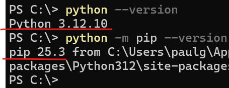
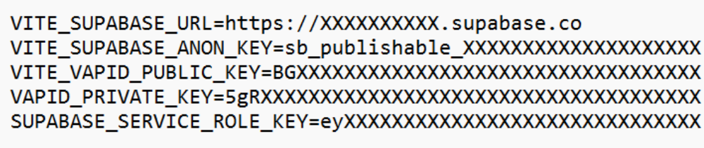

# Data Upload Guide

This document explains how to process and upload biosignal data from EmotiBit devices for all participants.

This data upload stage assumes:
- The BehaviorTrace website is deployed and operational, on Netlify (or similar host)
- The Supabase database is running (Or similar SQL cloud database), you will NEED a cloud SQL database to upload all the user data
- EmotiBit devices from participants are collected and you have their SD cards containing the biosignal data, which will be uploaded to the set up SQL database. 

If the steps above are not completed, you will not be able to upload successfully. To do this setup go to the initial setup guide [here](initial_setup.md) 

---

## 1. Prerequisites

### Python & pip
- Python **3.12.10** was used during development
- It is strongly recommended to use the same version

Download Python from:
https://www.python.org/downloads/

Verify installation:

```bash
python --version
python -m pip --version
```

Both commands should return valid versions.



---

## 2. Environment Setup

From the **GitHub root folder**:

1. Copy the previously created `.env` file
2. Paste it into:

```text
python_pipeline/
```

The `.env` file must contain all required Supabase and project keys from the initial setup.



---

## 3. Processing EmotiBit SD Card Data

You must process raw SD card data **before uploading**.

### Steps

1. Open the **EmotiBit Data Parser** 
2. Click the **square icon**
3. Select all raw biosignal files from the SD card
4. Process the files

If needed, refer to EmotiBit’s official documentation for detailed parsing instructions.


---

## 4. Organizing Participant Data

Once all data for a participant has been processed:

1. Create a **subfolder for that user**
2. Copy **ALL processed data files** into the subfolder
3. Repeat for every participant

---

### Expected Folder Structure

```text
emotibit_SD_data/
├── user_1/
├── user_2/
├── user_3/
└── user_4/
```

---

## 5. Running the Batch Upload Pipeline

Open a terminal **inside the `python_pipeline/` directory**.

### Install dependencies

```bash
pip install -r requirements.txt
```

### Run batch ingestion

```bash
python batch_ingest.py
```

---

### Notes
- Upload time depends on data volume
- Large datasets may take several minutes
- Do not interrupt the process once started

---

## 6. Troubleshooting

- Ensure `.env` is present in `python_pipeline/`
- Ensure all participant folders contain **processed**, not raw, data
- Confirm Python version compatibility
- Re-run `pip install -r requirements.txt` if errors occur

---

## 7. Next steps

Once all the data has been uploaded to the SQL database, training and testing the prediction based model can begin. The guide for this can be found below:

-  [Training and prediction](training_and_prediction.md)

---
