This README provides a **complete, step-by-step setup guide** for deploying the BehaviorTrace web application and its associated **Progressive Web App (PWA)** for mobile use.

Following these instructions you will have a fully operational system where:

- The **BehaviorTrace website** is deployed and connected to a database
- The **PWA phone app** is accessible to participants for in-study use
- **Administrators** can log in to create studies and configure behavioral labels
- **Participants** can log in on their phones and label their behaviors while wearing an EmotiBit device
- All behavioral labels are stored alongside biosignal data for later analysis

This guide focuses **only on the technical setup and deployment** required to make the system ready for study use.  
Study creation, participant workflows, and data processing are covered separately once setup is complete.


## 📺 Repository Overview Video

[](https://youtu.be/p5ERwq-JWYU)

---

## Table of Contents

- [Prerequisites](#prerequisites)
- [1) EmotiBit Setup](#1-emotibit-setup)
- [2) Clone the Repository](#2-clone-the-repository)
- [3) Create a Supabase Project](#3-create-a-supabase-project)
- [4) Supabase Security Options](#4-supabase-security-options)
- [5) Create Database Tables (SQL)](#5-create-database-tables-sql)
- [6) Configure `.env` — Supabase URL](#6-configure-env--supabase-url)
- [7) Configure `.env` — Supabase Publishable (Anon) Key](#7-configure-env--supabase-publishable-anon-key)
- [8) Configure `.env` — Supabase Service Role Key](#8-configure-env--supabase-service-role-key)
- [9) Install Node.js + Verify](#9-install-nodejs--verify)
- [10) Generate VAPID Keys (web-push)](#10-generate-vapid-keys-web-push)
- [11) Run Locally](#11-run-locally)
- [12) Create Admin Account (Sign Up)](#12-create-admin-account-sign-up)
- [13) Set Admin Role in Supabase](#13-set-admin-role-in-supabase)
- [14) Disable Email Confirmation (Recommended for Setup)](#14-disable-email-confirmation-recommended-for-setup)
- [15) Verify Admin Login](#15-verify-admin-login)
- [16) Deploy for Participants (GitHub + Netlify)](#16-deploy-for-participants-github--netlify)
- [17) Netlify Environment Variables](#17-netlify-environment-variables)
- [18) Confirm Deployment Works](#18-confirm-deployment-works)
- [19) Phone Setup (iPhone PWA)](#19-phone-setup-iphone-pwa)
- [Next Steps](#next-steps)

---

## Prerequisites

You will need:

- **Repository management:** GitHub (create an account if you haven't already) 
- **Website hosting:** Netlify  
  - You may use alternatives (e.g., Heroku), but Netlify deployment from GitHub is tested.
- **Database:** Supabase SQL  
  - You may use alternatives, but the project is tested with Supabase.
- **EmotiBit device(s):** depending on participant count  
  - US purchase link: https://shop.openbci.com/products/all-in-one-emotibit-bundle

The setup will cover a brief overview on setting up Netlify and Supabase.

---

## 1) EmotiBit Setup

Follow the official EmotiBit setup guide:

https://github.com/EmotiBit/EmotiBit_Docs/blob/master/Getting_Started.md#EmotiBit

**Important:** EmotiBit must be operational and running. **Recording and biosignal streaming happens from the Oscilloscope.** Each EmotiBit device needs to be set up for each participant in the study.

> 
---

## 2) Clone the Repository

Clone the repository from GitHub:

```bash
git clone https://github.com/geddie212/BehaviorTrace.git
cd BehaviorTrace
```

---

## 3) Create a Supabase Project

1. Create a Supabase account
2. Create a **new project**

> 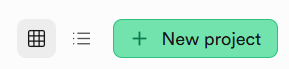

---

## 4) Supabase Security Options

During project setup (or in relevant settings), ensure:

- **Data API + Connection string** is selected
- **Public schema for Data API** is selected

> 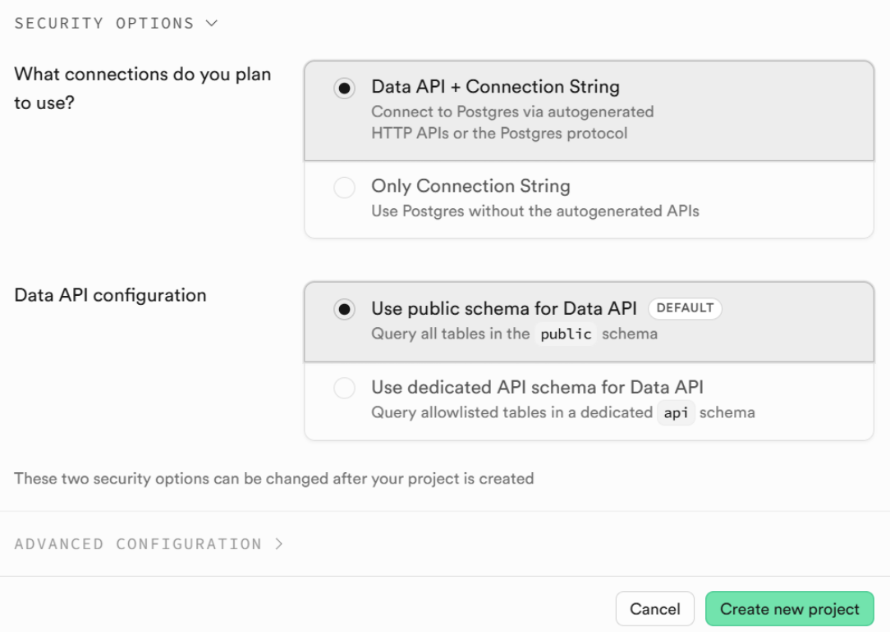

---

## 5) Create Database Tables (SQL)

1. Go to **Supabase → SQL Editor**
2. In your cloned repo, open:

```
BehaviorTrace/SQL_commands/table_commands.SQL
```

3. Copy/paste all SQL from that file into the Supabase SQL Editor and **Run**
4. Confirm you see: **“Success. No rows returned”**

> 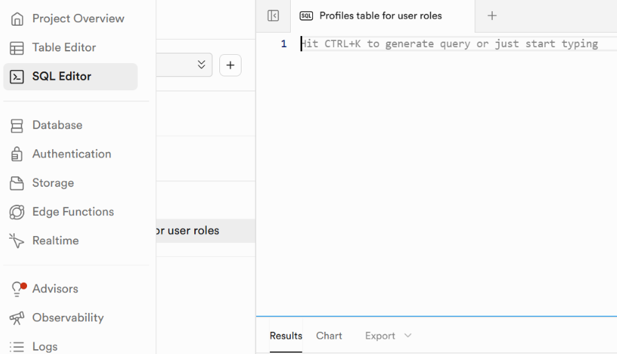

---

## 6) Configure `.env` — Supabase URL

1. Open:

```
BehaviorTrace/.env
```

2. In Supabase, go to:

**Project Settings → Data API**

3. Copy the **Project URL**
4. Paste into `.env`:

```env
VITE_SUPABASE_URL=https://xxxxxxxxxxxx.supabase.co
```

> 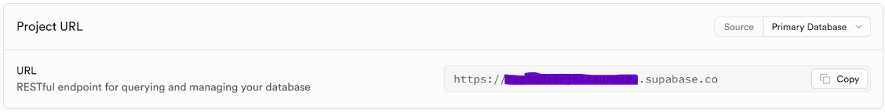

---

## 7) Configure `.env` — Supabase Publishable (Anon) Key

1. In Supabase, go to:

**Settings → API Keys**

2. Copy the **Publishable key**
3. Paste into `.env`:

```env
VITE_SUPABASE_ANON_KEY=sb_publishable_xxxxxxxxxxxxxxxxx
```

> 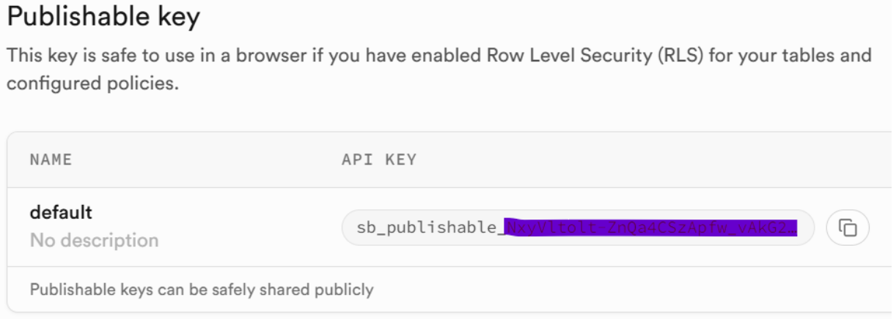

---

## 8) Configure `.env` — Supabase Service Role Key

1. In Supabase, go to:

**API Keys → Legacy anon, service_role API keys**

2. Reveal the **service_role** key
3. Paste into `.env`:

```env
SUPABASE_SERVICE_ROLE_KEY=eyxxxxxxxxxxxxxxxxxxxxxxxx
```

> 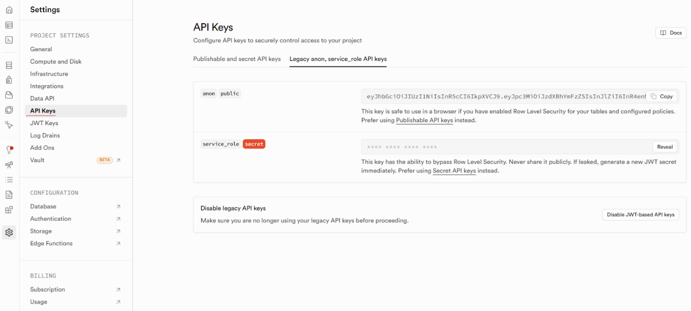

---

## 9) Install Node.js + Verify

Install Node.js from the official website:  
https://nodejs.org

Verify in a terminal:

```bash
node -v
npm -v
```

You should see version numbers for both.

>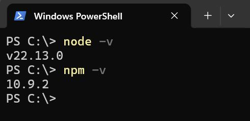

---

## 10) Generate VAPID Keys (web-push)

From the **GitHub repo root folder**, open a terminal (PowerShell is fine on Windows):

1. Install `web-push` globally:

```bash
npm install -g web-push
```

2. Generate VAPID keys:

```bash
web-push generate-vapid-keys
```

You will receive:
- **Public Key**
- **Private Key**

Now, with `.env` open, paste:

- Public Key → `VITE_VAPID_PUBLIC_KEY`
- Private Key → `VAPID_PRIVATE_KEY`

Example:

```env
VITE_VAPID_PUBLIC_KEY=BGxxxxxxxxxxxxxxxxxxxxxxxx
VAPID_PRIVATE_KEY=5gxxxxxxxxxxxxxxxxxxxxxxxx
```

**Save** the `.env` file.

>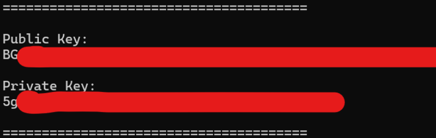
>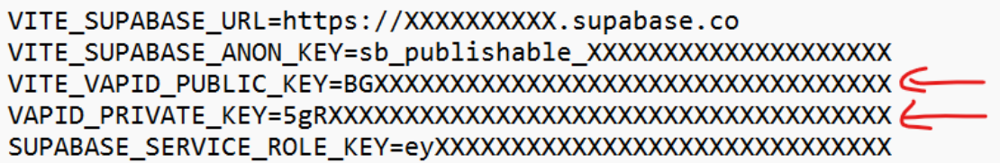

---

## 11) Run Locally

In the repo root:

1. Install dependencies:

```bash
npm install
```

2. Start dev server:

```bash
npm run dev
```

3. Click the link shown in the terminal (or copy/paste into your browser)

If `.env` parameters are correct, you should see the login page.

> 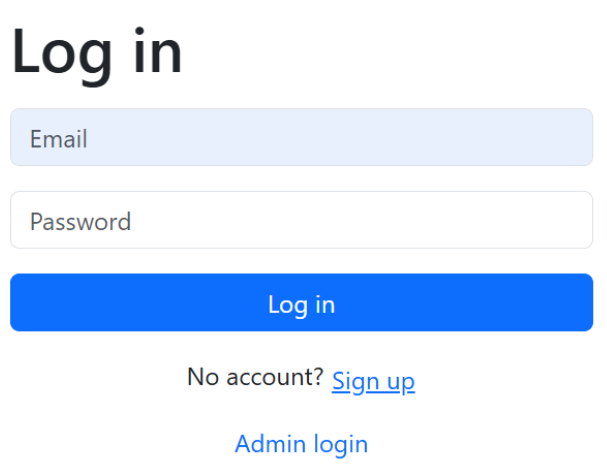

---

## 12) Create Admin Account (Sign Up)

1. On the login page, click **Sign up**
2. Enter an administrator’s email + password  
   - You can create multiple administrators
3. After signing up, you should see a popup: **“signed up, please login”**

> 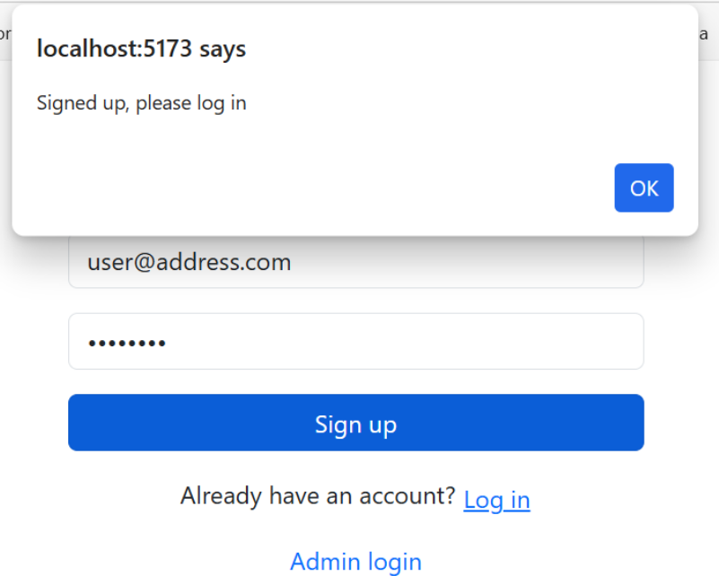

---

## 13) Set Admin Role in Supabase

1. Go to **Supabase → SQL / Table Editor → `profiles`**
2. Find the user you want to set as admin
3. Double-click the `role` field and set it to:

```
admin
```

> Note: You can do this in SQL as well if you copy/paste the user ID, but editing the table is the fastest.

> 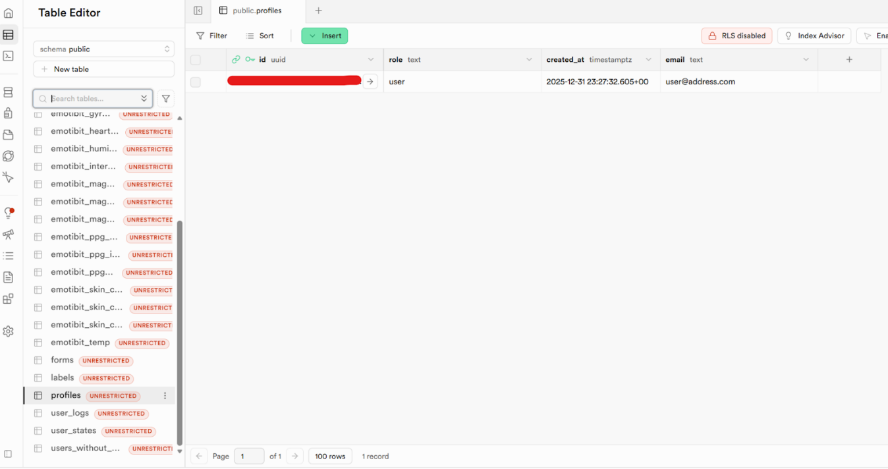
> 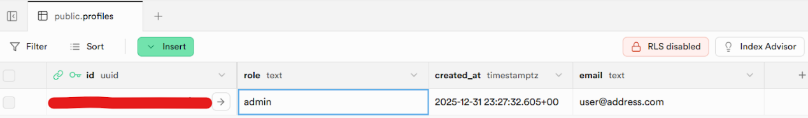

---

## 14) Disable Email Confirmation (Recommended for Setup)

Go to:

**Supabase → Authentication → Sign in / Providers**

Turn **Confirm email** OFF.

> Note: You can keep it ON, but Supabase often has SMTP confirmation issues during setup.  
> You can later configure custom SMTP for reliability.

> 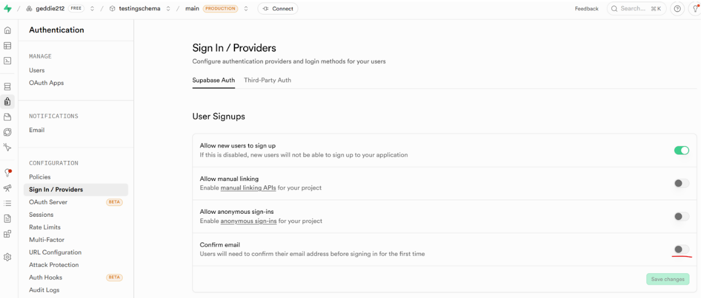

---

## 15) Verify Admin Login

1. Click the **admin login** link in the app
2. Log in with your admin credentials
3. If you see the **Admin Dashboard**, it worked

> 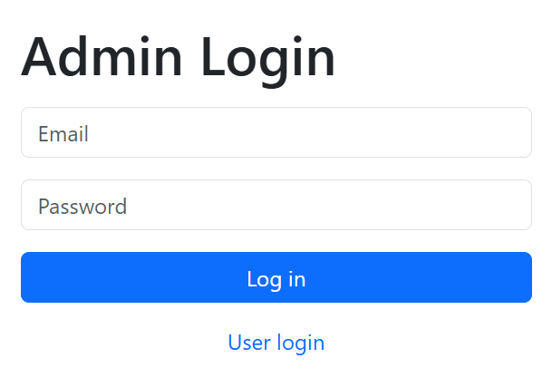 
> 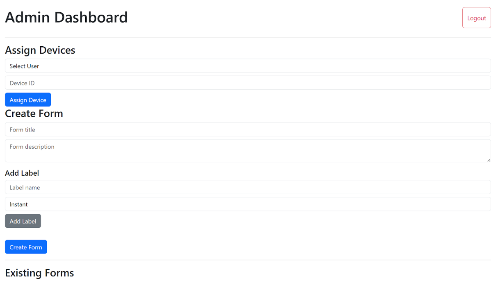

---

## 16) Deploy for Participants (GitHub + Netlify)

Participants should use the app from their phones while wearing EmotiBit, so you should deploy the app (Netlify recommended).

### 16.1 Dashboard capabilities

In the dashboard, admins can:

- assign participants their EmotiBit device IDs
- create and delete forms for behaviors being studied

### 16.2 Ensure repository remote points to YOUR repo

From the downloaded repo root:

```bash
git remote -v
```

If you see:

```
origin https://github.com/geddie212/BehaviorTrace.git (fetch)
origin https://github.com/geddie212/BehaviorTrace.git (push)
```

Do this:

1. Create a **NEW empty GitHub repository**
   - https://github.com/new
   - name it (example): `Trace-experiment`
   - create repository
2. Copy the new repo URL
3. In your terminal:

```bash
git remote add origin <repoURL>
git commit -m "initial"
git push
```

---

## 17) Netlify Environment Variables

1. Create a Netlify account: https://app.netlify.com/
2. Create a new project and **import from an existing project**
3. Connect to GitHub and select your uploaded repo

Then:

1. Open your local `.env`
2. Copy **all** contents (all variables)
3. Paste them into **Netlify → Environment variables**

**Important:** Your GitHub repo **must NOT** contain the `.env` file.  
- `.env` should only be stored locally  
- If it’s in your repo, delete it and use Netlify env vars instead

> 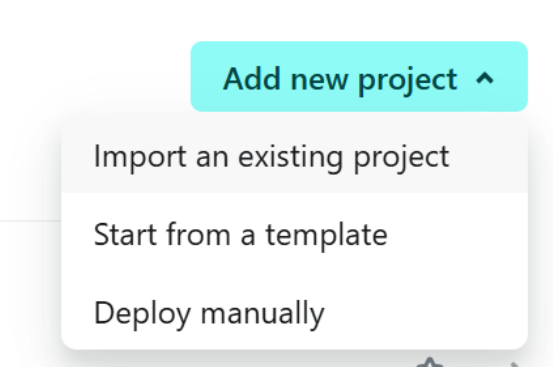
> 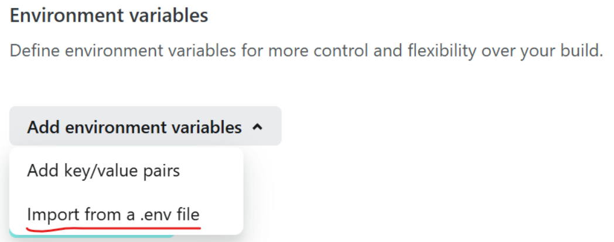
> 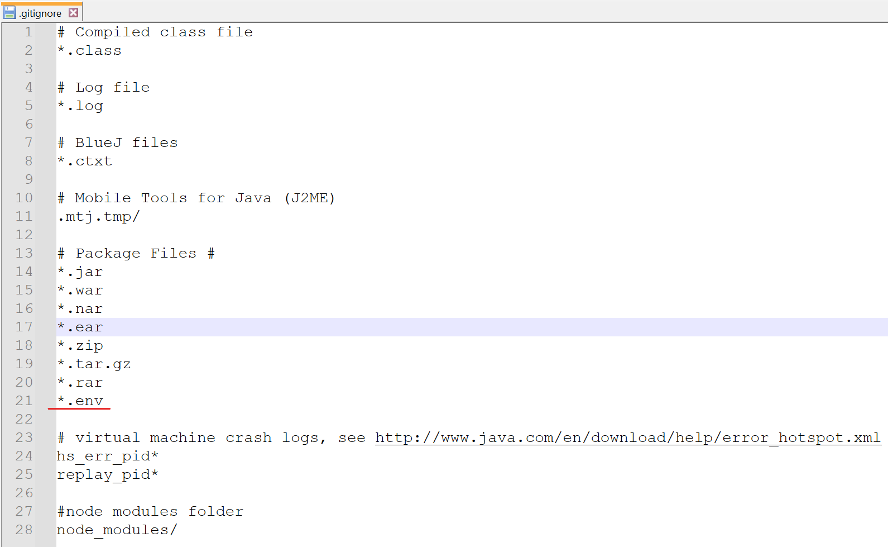

---

## 18) Confirm Deployment Works

If everything is correct, the project should deploy.

1. Open the Netlify URL
2. Verify:
   - you can log in as **admin**
   - you can log in as **user** (participant)

> 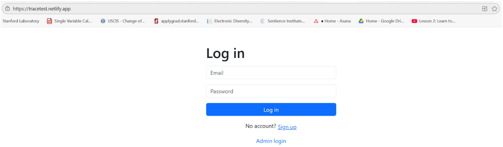

---

## 19) Phone Setup (iPhone PWA)

To make participant access easy, install the app as a PWA on iPhone.

1. Open the **Netlify URL** on the iPhone
2. Tap the **Share** icon (bottom middle)
3. Choose **Add to Home Screen**
4. Participants/Admins can name the app anything they like
5. The app icon will appear on the home screen for easy access

> 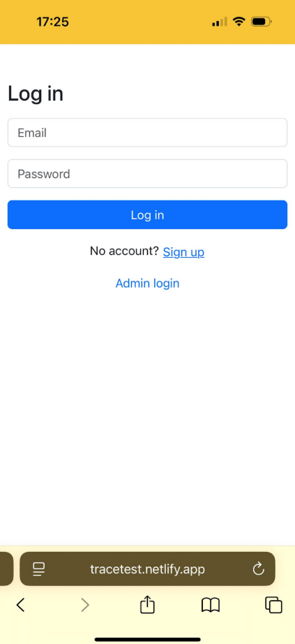
> 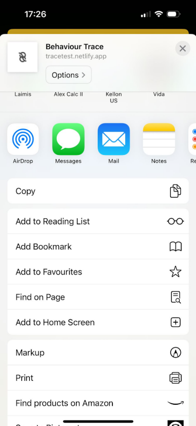
> 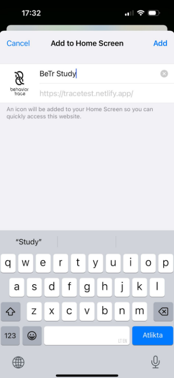
>  

---

## Next Steps

Initial setup for admins and participants is complete.

Next step is:
-  [Creating and setting up the study](study_setup.md)


