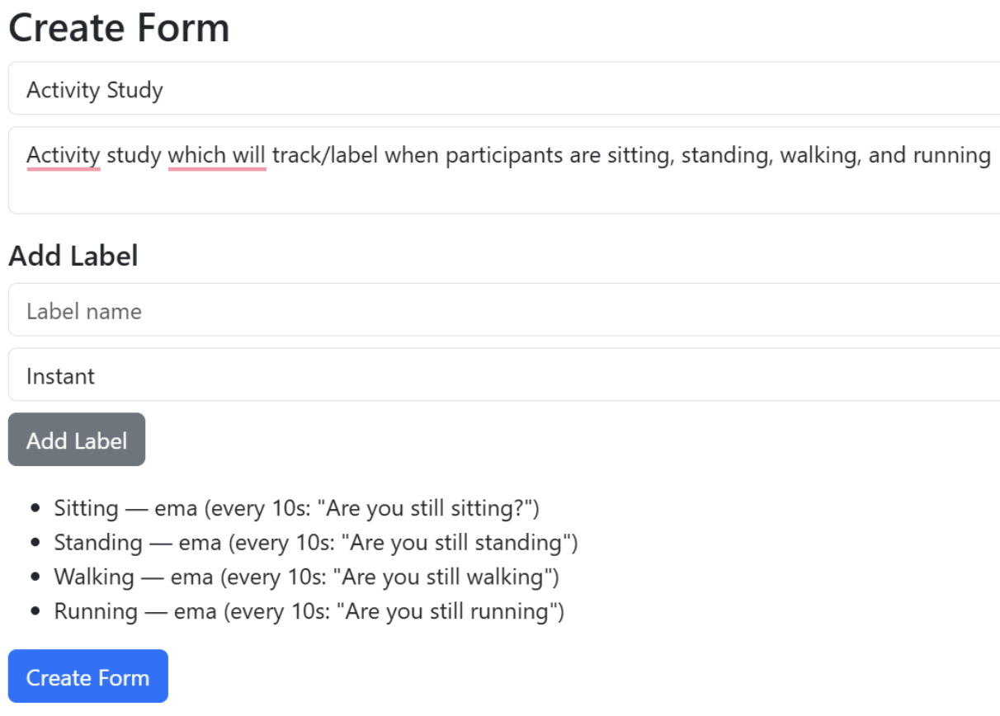
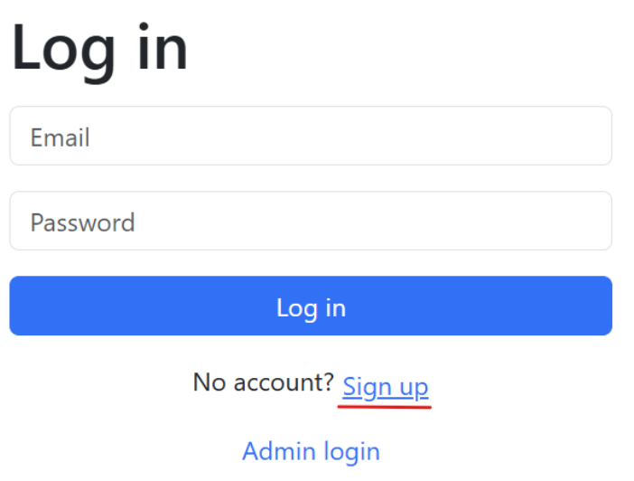
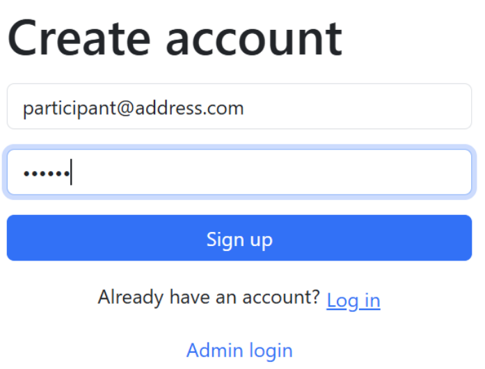
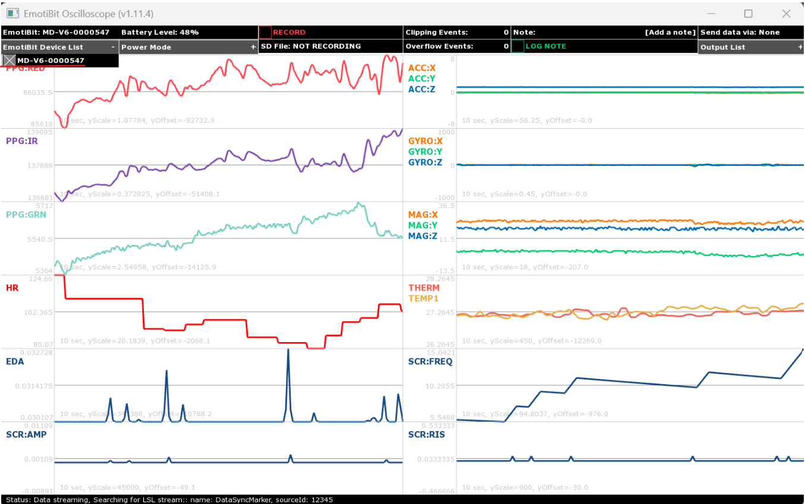
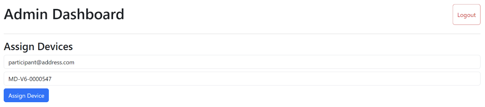
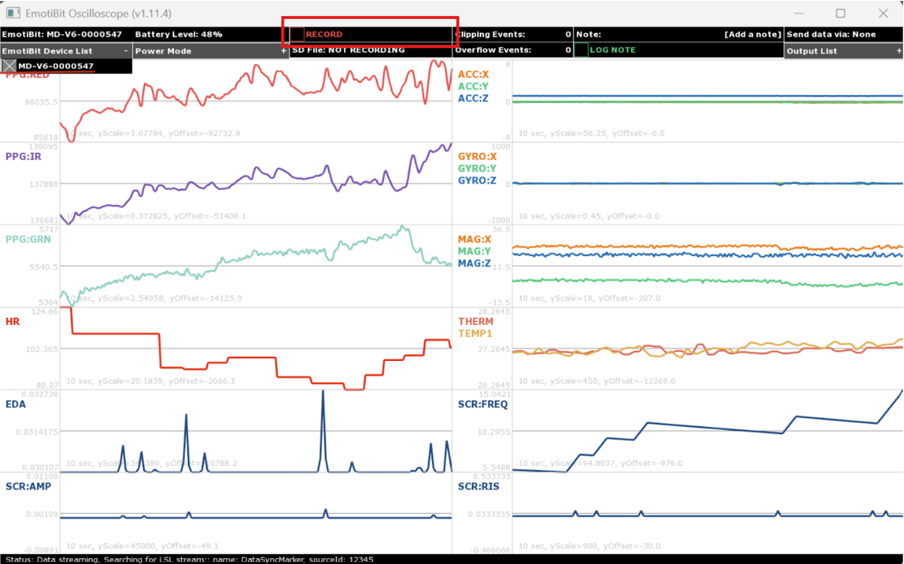
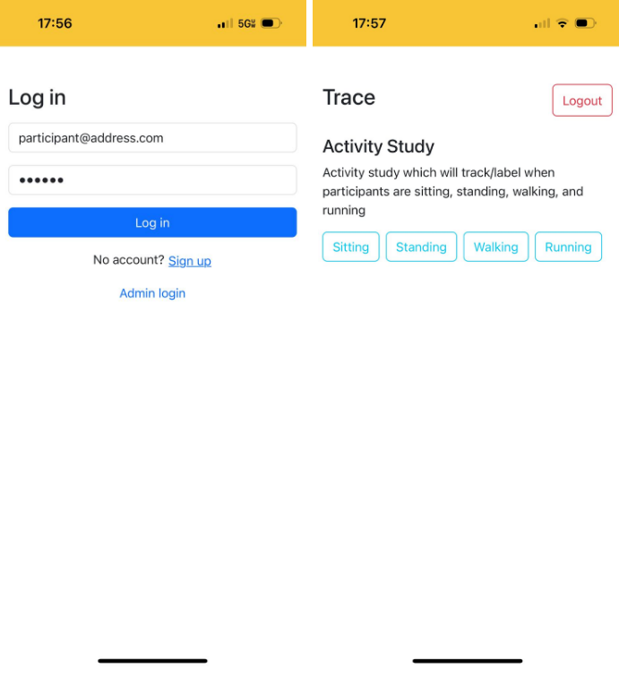

# Study Setup — EMA / State Confirmation Study (BehaviorTrace)

This guide explains how to **create and run a study** in BehaviorTrace after the platform has been deployed.
It focuses on **EMA (state confirmation) studies**, where participants confirm their current state while
biosignals are recorded from an EmotiBit device.

This study setup assumes:
- The BehaviorTrace website is deployed and operational, on Netlify (or similar host)
- The Supabase database is running (Or similar SQL cloud database)
- EmotiBit devices are fully set up and streaming data

---

## Important Notes

- **Version 1.0 limitation:**  
  Only **EMA / state confirmation** labels are currently used for model creation and prediction.
  Instant and decay labels can be created, but the ML pipeline must be modified for accurate use.

- This guide uses a **simple activity study** (sitting, standing, walking, running) so researchers can
  understand the full workflow before designing more complex studies.

### Example Study Applications
- Substance use / cravings / withdrawal
- Stress reactivity and daily stressors
- Sleep and fatigue
- Pain and symptom fluctuation
- Environmental exposure
- JITAI (Just-in-Time Adaptive Interventions)
- Physical activity validation

---

## Pre‑requisites

- EmotiBit devices configured and operational  
  Setup guide: https://github.com/EmotiBit/EmotiBit_Docs/blob/master/Getting_Started.md

- BehaviorTrace web app deployed
- Supabase SQL database running

If these are not setup, go back to the initial setup readme [here.](initial_setup.md)

---

## 1. Admin Login

1. Navigate to the deployed BehaviorTrace website
2. Log in using an **admin account**
3. You will be redirected to the **Admin Dashboard**

---

## 2. Create a Study Form

In the **Create Form** section of the Admin Dashboard, enter:

- **Form Title:** Activity Study
- **Form Description:**  
  Activity study which will track/label when participants are sitting, standing, walking, and running

---

## 3. Add EMA State Labels

Add the following labels **one at a time**.

### Sitting
- Label name: `Sitting`
- Label type: `State (EMA)`
- Prompt interval (seconds): `10`
- State prompt: `Are you still sitting?`

Click **Add Label**

---

### Standing
- Label name: `Standing`
- Label type: `State (EMA)`
- Prompt interval (seconds): `10`
- State prompt: `Are you still standing?`

Click **Add Label**

---

### Walking
- Label name: `Walking`
- Label type: `State (EMA)`
- Prompt interval (seconds): `10`
- State prompt: `Are you still walking?`

Click **Add Label**

---

### Running
- Label name: `Running`
- Label type: `State (EMA)`
- Prompt interval (seconds): `10`
- State prompt: `Are you still running?`

Click **Add Label**

---

## 4. Create the Form

Once all labels are added:

1. Click **Create Form**
2. The study is now available to participants

---

## 5. Participant Account Setup

Each participant must:

1. Sign up with an email and password
2. Log in on their phone or desktop

---

## 6. Assign EmotiBit Device

The study admin must assign an EmotiBit to each participant.

### Steps

1. Power on the EmotiBit
2. Ensure:
   - EmotiBit and Oscilloscope are on the **same Wi‑Fi**
   - Oscilloscope is running
3. Copy the **Device ID** from the Oscilloscope
4. In the Admin Dashboard:
   - Select the participant
   - Paste the Device ID
   - Click **Assign Device**

---

## 7. Start Recording

1. In the Oscilloscope, click **Record**
2. Attach the EmotiBit to the participant’s wrist
3. The Oscilloscope may now be closed — recording continues on-device

---

## 8. Phone App (PWA) Setup

Participants should add the app to their phone home screen.

### iPhone Steps
1. Open the deployed Netlify URL
2. Tap the **Share** icon
3. Select **Add to Home Screen**
4. Name the app as desired

---

## 9. Running the Study

With the EmotiBit on their wrist, participants can:

1. Open the app
2. Log in
3. Select the study
4. Tap the label that matches their current activity

The app will:
- Prompt the participant every 10 seconds to confirm the state
- Allow them to leave and re-enter the app at any time

---

## 10. Study Completion

- This process must be repeated for **each participant**
- All biosignal data and EMA labels are stored in the database
- Data can later be processed for model training and prediction

---

## Next Tutorial

The next guide covers:
-  [Processing biosignal and label data](data_upload.md)

